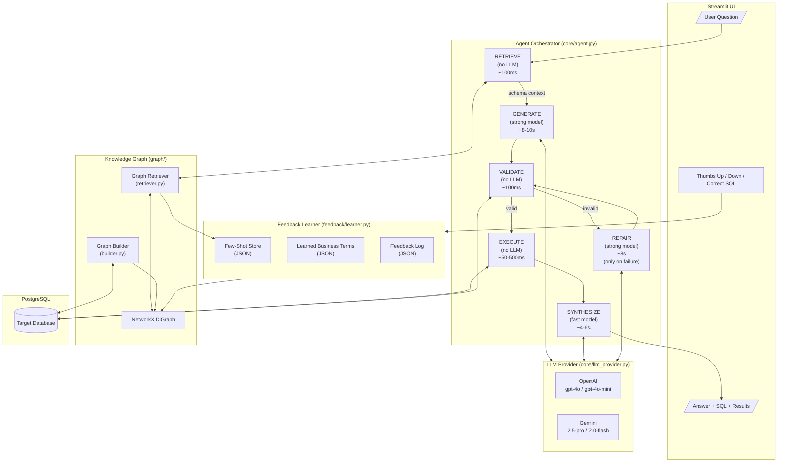
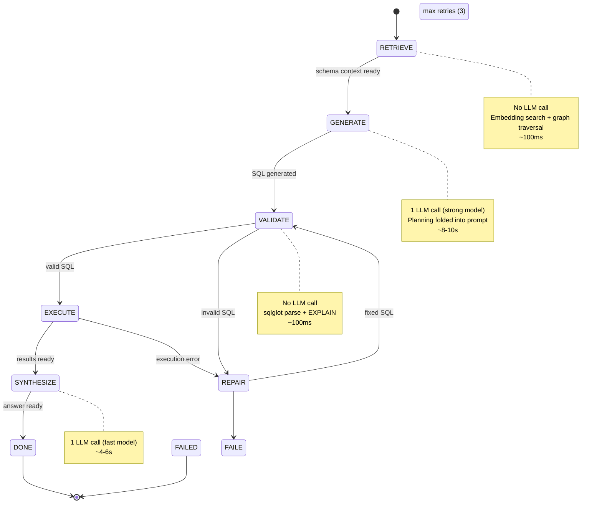
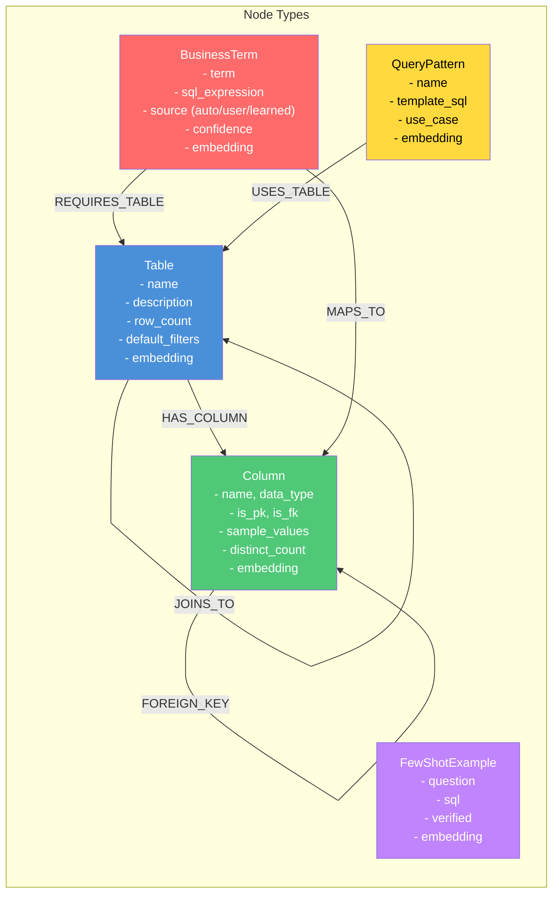
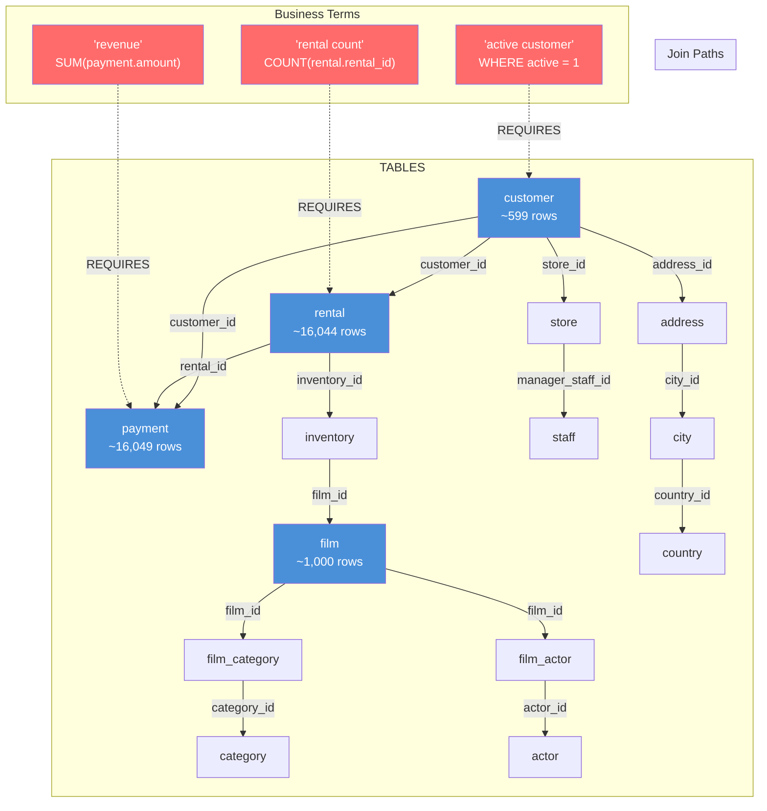
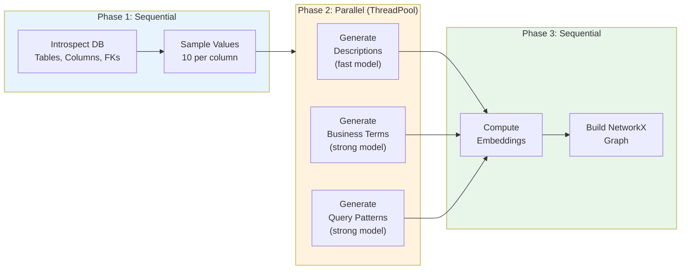
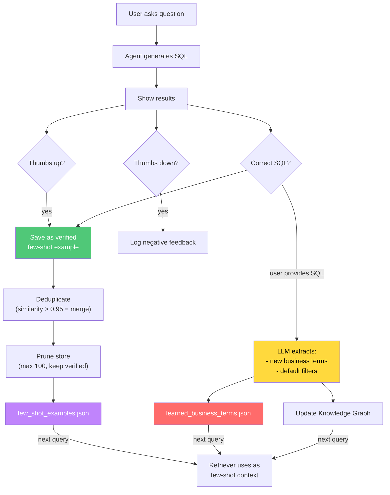

# GraphRAG SQL Agent — Architecture & Documentation

---

## 1. System Architecture (Code Flow)



---

## 2. Agent Pipeline (State Machine)



---

## 3. Knowledge Graph Schema



---

## 4. Knowledge Graph — Pagila Example



---

## 5. Graph Build Pipeline



---

## 6. Feedback Learning Loop



---

## 7. Model Recommendations

### OpenAI

| Role | Model | Latency (p50) | Cost per 1M tokens | When Used |
|------|-------|---------------|---------------------|-----------|
| **Strong** (SQL gen, repair) | `gpt-4o` | ~2-4s | $2.50 in / $10 out | Every query (GENERATE), on failure (REPAIR) |
| **Fast** (synthesize) | `gpt-4o-mini` | ~1-2s | $0.15 in / $0.60 out | Every query (SYNTHESIZE) |
| **Embedding** | `text-embedding-3-small` | ~200ms/batch | $0.02 / 1M tokens | Graph build + query-time retrieval |
| **Alternative Strong** | `gpt-4.1` | ~2-4s | $2.00 in / $8 out | Newer, potentially better SQL |
| **Alternative Fast** | `gpt-4.1-mini` | ~1s | $0.40 in / $1.60 out | Faster alternative |

### Gemini

| Role | Model | Latency (p50) | Cost per 1M tokens | When Used |
|------|-------|---------------|---------------------|-----------|
| **Strong** (SQL gen, repair) | `gemini-2.5-pro` | ~5-10s | $1.25 in / $10 out | Every query (GENERATE), on failure (REPAIR) |
| **Fast** (synthesize) | `gemini-2.0-flash` | ~2-4s | $0.10 in / $0.40 out | Every query (SYNTHESIZE) |
| **Embedding** | `gemini-embedding-001` | ~300ms | Free (under limits) | Graph build + query-time retrieval |
| **Alternative Strong** | `gemini-2.5-flash` | ~3-5s | $0.15 in / $3.50 out | Good balance of speed + quality |
| **Budget** | `gemini-2.0-flash-lite` | ~1-2s | $0.075 in / $0.30 out | If cost is primary concern |

### Recommended Configurations

**Best Accuracy (OpenAI):**
```
Strong: gpt-4o       Fast: gpt-4o-mini       Embedding: text-embedding-3-small
Expected latency: 4-8s | Cost: ~$0.02/query
```

**Best Accuracy (Gemini):**
```
Strong: gemini-2.5-pro   Fast: gemini-2.0-flash   Embedding: gemini-embedding-001
Expected latency: 8-16s | Cost: ~$0.01/query
```

**Best Speed (Gemini):**
```
Strong: gemini-2.5-flash   Fast: gemini-2.0-flash-lite   Embedding: gemini-embedding-001
Expected latency: 5-10s | Cost: ~$0.005/query
```

**Best Speed (OpenAI):**
```
Strong: gpt-4.1-mini   Fast: gpt-4.1-mini   Embedding: text-embedding-3-small
Expected latency: 2-5s | Cost: ~$0.005/query
```

---

## 8. Latency Breakdown

```mermaid
gantt
    title Query Latency Breakdown (Happy Path)
    dateFormat X
    axisFormat %s

    section No LLM
    RETRIEVE (graph search)     :0, 100
    VALIDATE (sqlglot+EXPLAIN)  :10200, 10300
    EXECUTE (DB query)          :10300, 10500

    section LLM Calls
    GENERATE (strong model)     :100, 10200
    SYNTHESIZE (fast model)     :10500, 14500

    section Total
    End-to-end                  :milestone, 14500, 0
```



| Scenario | LLM Calls | Latency (OpenAI) | Latency (Gemini) |
|----------|-----------|-------------------|-------------------|
| **Happy path** | 2 (generate + synthesize) | **4-8s** | **10-16s** |
| **1 repair** | 3 (+repair) | **8-14s** | **18-26s** |
| **3 repairs (worst)** | 5 | **16-24s** | **34-42s** |

---

## 9. Component Deep Dive

### 9.1 Agent Orchestrator (`core/agent.py`)

The central state machine that drives the entire question-to-answer pipeline.

**Class:** `SQLAgent`

| Method | Purpose |
|--------|---------|
| `run(question, on_state_change)` | Main entry point — walks through all states, returns `AgentContext` |
| `_retrieve()` | Calls `GraphRetriever` to find relevant schema context (tables, columns, FKs, terms, few-shot) |
| `_generate()` | Single LLM call (strong model) to produce SQL from context + few-shot examples |
| `_validate()` | Pure compute — `SQLValidator.validate()` checks syntax, schema, EXPLAIN dry-run |
| `_repair()` | On validation failure, calls LLM (strong model) with error details to fix SQL |
| `_execute()` | Runs validated SQL via `SQLExecutor`, returns DataFrame |
| `_synthesize()` | Single LLM call (fast model, JSON mode) to produce a natural-language answer |

**Key design decisions:**
- Only **2 LLM calls** on the happy path (GENERATE + SYNTHESIZE) — DECOMPOSE and PLAN stages were eliminated for speed.
- REPAIR only fires on failure — no wasted LLM calls on valid queries.
- `on_state_change` callbacks enable real-time UI progress updates.

---

### 9.2 LLM Provider (`core/llm_provider.py`)

Unified interface for OpenAI and Gemini APIs with lazy client initialization.

**Class:** `LLMProvider`

| Method | Purpose |
|--------|---------|
| `chat(messages, model, temperature, json_mode, stage)` | Returns `(response_text, LLMCallLog)` — measures latency and tokens |
| `_chat_openai()` | OpenAI-specific call with optional JSON response format |
| `_chat_gemini()` | Gemini-specific call — separates system instruction from conversation |
| `embed(texts)` | Batch embedding (100 at a time for OpenAI, 20 for Gemini) |
| `embed_single(text)` | Single text embedding for query-time retrieval |

**Utility:** `cosine_similarity(a, b)` — vector similarity for embedding-based retrieval.

**Key design decisions:**
- Clients are lazy-initialized on first use (no overhead if a provider is unused).
- Separate fast/strong model roles allow cost optimization per stage.
- Token counting estimates Gemini tokens (~4 chars/token) when metadata is unavailable.

---

### 9.3 SQL Validator & Executor (`core/validator.py`)

Validates generated SQL for safety and correctness; executes queries against PostgreSQL.

**Class:** `SQLValidator`

Validation is a 5-step pipeline:

| Step | What it does |
|------|-------------|
| 1. Security check | Blocks DDL/DML keywords (DROP, INSERT, UPDATE, DELETE, TRUNCATE, ALTER, CREATE, GRANT, REVOKE) |
| 2. Multi-statement guard | Rejects SQL with `;` — prevents injection |
| 3. Syntax check | Parses via `sqlglot` — catches malformed SQL |
| 4. Schema validation | Extracts table/column references from AST, checks against known schema (CTE names are whitelisted) |
| 5. EXPLAIN dry-run | Executes `EXPLAIN` to validate the query plan without running the actual query |

Additional method: `inject_limit(sql, max_rows)` — adds a `LIMIT` clause if missing, preventing runaway queries.

**Class:** `SQLExecutor`

| Method | Purpose |
|--------|---------|
| `execute(sql)` | Runs query via psycopg2 with `statement_timeout`, returns `(DataFrame, column_list)` |

---

### 9.4 Data Models (`core/models.py`)

All dataclass definitions used across the system.

**Graph nodes:**

| Model | Key Fields |
|-------|-----------|
| `TableNode` | name, schema, description, row_count, columns[], default_filters[], embedding[] |
| `ColumnNode` | name, table_name, data_type, is_primary_key, is_foreign_key, sample_values[], distinct_count, embedding[] |
| `ForeignKey` | source_table, source_column, target_table, target_column; property `join_sql` |
| `BusinessTerm` | term, sql_expression, tables_involved[], source (auto/user/learned/doc), confidence, embedding[] |
| `QueryPattern` | name, template_sql, use_case, tables_involved[], embedding[] |
| `FewShotExample` | question, sql, tables_used[], verified, embedding[] |

**Agent state:**

| Model | Purpose |
|-------|---------|
| `AgentState` (Enum) | RETRIEVE, GENERATE, VALIDATE, REPAIR, EXECUTE, SYNTHESIZE, DONE, FAILED |
| `RetrievedContext` | Holds tables, columns, FKs, join_paths, business_terms, few_shot_examples, value_matches; `to_context_string()` formats it for LLM prompts |
| `ValidationResult` | syntax_ok, tables_exist, explain_ok, error_message; property `is_valid` |
| `LLMCallLog` | stage, model, tokens_in, tokens_out, latency_ms |
| `AgentContext` | Main state holder: question, state, context, SQL, results, answer, llm_calls[]; properties `total_latency_ms`, `total_cost_estimate` |

---

### 9.5 Knowledge Graph Builder (`graph/builder.py`)

Automatically constructs a semantic knowledge graph from PostgreSQL schema via introspection + LLM enrichment.

**Class:** `GraphBuilder`

**Build pipeline (7 steps):**

| Step | Method | LLM? | What it does |
|------|--------|-------|-------------|
| 1 | `_introspect_schema()` | No | Queries `information_schema` for tables, columns, FKs, row counts, distinct counts |
| 2 | `_sample_values()` | No | Samples distinct values per column (all values if <50 distinct, else N samples) |
| 3 | `_generate_descriptions()` | Fast model | Generates human-readable descriptions for tables and columns |
| 4 | `_generate_business_terms()` | Strong model | Discovers 15-20 business terms (metrics, KPIs, status terms) with SQL expressions |
| 5 | `_generate_query_patterns()` | Strong model | Generates reusable SQL templates (top-N, YoY, running totals, cohort, etc.) |
| 6 | `_compute_embeddings()` | Embedding model | Batch embeds all node descriptions |
| 7 | `_build_networkx_graph()` | No | Assembles NetworkX DiGraph with typed nodes and edges |

**Parallelization:** Steps 3-5 run concurrently via `ThreadPoolExecutor` (3 workers) — the biggest time save.

**Dynamic updates:**
- `add_business_term(term)` — used by feedback learner to inject user-defined terms
- `add_default_filter(table_name, filter_sql)` — used by feedback learner for table-level filters

**Graph structure:**
- **Node types:** table, column, business_term, query_pattern
- **Edge types:** HAS_COLUMN, FOREIGN_KEY, JOINS_TO, REQUIRES_TABLE, USES_TABLE

---

### 9.6 Graph Retriever (`graph/retriever.py`)

Core accuracy driver — retrieves relevant schema context for a given question using embeddings, graph traversal, and fuzzy matching. **No LLM calls** — pure compute.

**Class:** `GraphRetriever`

**7-step retrieval pipeline:**

| Step | Method | What it does |
|------|--------|-------------|
| 1 | `_find_relevant_tables()` | Scores tables by embedding similarity (70%) + keyword matching (30%); returns top N above 0.3 threshold |
| 2 | `_find_relevant_columns()` | Ranks columns from matched tables by embedding (50%) + keyword match (40%) + PK/FK boost (20%) |
| 3 | `_expand_via_graph()` | Graph traversal to find FK join paths; uses `nx.shortest_path()` for disconnected tables |
| 4 | `_match_business_terms()` | Finds terms by exact match, embedding similarity, and fuzzy string matching (SequenceMatcher > 0.5) |
| 5 | `_fuzzy_match_values()` | Matches user-mentioned values against low-cardinality column enums (fuzzy score > 0.8) |
| 6 | `_match_query_patterns()` | Finds relevant query patterns by embedding similarity (> 0.5 threshold) |
| 7 | `_retrieve_few_shot()` | Retrieves similar past question-SQL pairs; boosts verified examples; fits within token budget |

**Token budget management:** `trim_context_to_budget()` prioritizes tables > columns > FKs > business terms > patterns, keeping all PKs/FKs and dropping lowest-value items to stay under `max_context_tokens`.

---

### 9.7 Feedback Learner (`feedback/learner.py`)

Learns from user interactions to improve future responses. All learnings persist immediately to JSON files.

**Class:** `FeedbackLearner`

**Public API:**

| Method | Trigger | What it does |
|--------|---------|-------------|
| `on_positive_feedback(ctx)` | User clicks thumbs up | Saves question-SQL as verified few-shot example; deduplicates and prunes store |
| `on_sql_correction(ctx, corrected_sql, explanation)` | User provides correct SQL | Saves corrected pair; uses LLM to extract new business terms and default filters |
| `on_negative_feedback(ctx, reason)` | User clicks thumbs down | Logs to feedback_log.json for offline review |
| `on_business_term_correction(term, sql, tables, desc)` | User defines a term | Adds to graph via `graph_builder.add_business_term()` |
| `on_default_filter_suggestion(table, filter_sql)` | User suggests a filter | Adds to graph via `graph_builder.add_default_filter()` |

**Internal learning logic:**
- **`_extract_and_learn_terms()`** — LLM call (fast model, JSON mode) parses corrected SQL to extract business terms and default filters
- **`_deduplicate_and_store()`** — Exact question match → update SQL; semantic duplicate (> 0.95 similarity) → keep shorter SQL; otherwise → add new
- **`_prune_store()`** — Never deletes verified examples; removes oldest unverified when over `max_stored_examples` (100)

**Persistence files:**
| File | Content |
|------|---------|
| `data/few_shot_examples.json` | Verified and unverified question-SQL pairs |
| `data/learned_business_terms.json` | Terms extracted from user corrections |
| `data/feedback_log.json` | All feedback events with timestamps |

---

### 9.8 Prompt Templates (`prompts/templates.py`)

Central prompt templates for all LLM stages.

| Template | Used In | Key Rules |
|----------|---------|-----------|
| `SQL_GENERATOR_SYSTEM/USER` | GENERATE stage | 11 rules: use only provided schema, explicit JOINs, GROUP BY all non-aggregated columns, use business term expressions, respect MATCHED VALUES, apply DEFAULT FILTERS, use DATE functions, CTEs for complexity |
| `REPAIR_SYSTEM/USER` | REPAIR stage | Fix only the specific error, preserve intent; includes original question, failed SQL, error message, EXPLAIN output, attempt number |
| `SYNTHESIZER_SYSTEM/USER` | SYNTHESIZE stage | Lead with direct answer, format numbers, summarize key insights, mention outliers; outputs JSON with `answer` and `key_insights` |
| `TERM_EXTRACTOR_SYSTEM/USER` | Feedback learning | Analyze corrections and extract business term definitions; outputs JSON array of terms + default filters |

---

### 9.9 Configuration (`config.py`)

Centralized configuration via dataclasses.

**`DBConfig`** — host, port, database, user, password; property `connection_string`

**`LLMConfig`** — provider ("openai"/"gemini"), API keys, fast/strong/embedding model names

**`AgentConfig`** — key defaults:

| Parameter | Default | Purpose |
|-----------|---------|---------|
| `max_repair_attempts` | 3 | Prevent infinite repair loops |
| `query_timeout_seconds` | 30 | Prevent runaway queries |
| `max_result_rows` | 1000 | Cap result size |
| `max_tables_in_context` | 10 | Schema linking breadth |
| `max_columns_per_table` | 50 | Column depth per table |
| `max_few_shot_examples` | 3 | Few-shot examples per query |
| `max_context_tokens` | 3000 | Token budget for retrieved context |
| `max_stored_examples` | 100 | Few-shot store capacity |
| `example_dedup_threshold` | 0.95 | Semantic dedup threshold |

---

### 9.10 Streamlit UI (`app.py`)

Web interface with 5 pages:

| Page | Purpose | Key Features |
|------|---------|-------------|
| **Connect** | Database & LLM setup | PostgreSQL credentials, provider selection, connection test |
| **Build Graph** | Knowledge graph construction | Progress bar, step-by-step status, summary metrics, rebuild option |
| **Ask Questions** | Chat interface | Real-time state transitions, answer + SQL + results display, feedback buttons |
| **Teach & Feedback** | User corrections | 4 tabs: correct SQL, define business terms, add default filters, add examples |
| **Dashboard** | System overview | Graph metrics, learning stats, schema browser, business term breakdown, recent feedback |

**Key implementation details:**
- Session state persists agent, graph, retriever across interactions
- Lazy initialization — components only created after successful DB connection
- `on_state_change` callbacks enable real-time progress in the UI
- Chat history stored in session state (not persisted between sessions)

---

## 10. Data Flow Example

```
User: "What are top 5 customers by revenue this year?"
  │
  ├─ 1. RETRIEVE (~100ms, no LLM)
  │     GraphRetriever embeds question → finds "customer" + "payment" tables
  │     Expands via FK paths → discovers join through rental
  │     Matches "revenue" business term → SUM(payment.amount)
  │     Retrieves 2 similar few-shot examples
  │     Returns RetrievedContext
  │
  ├─ 2. GENERATE (~8s, strong model)
  │     Formats context as markdown (tables, columns, FKs, terms, few-shot)
  │     LLM produces: SELECT c.first_name, SUM(p.amount) AS revenue ...
  │
  ├─ 3. VALIDATE (~100ms, no LLM)
  │     Security check ✓  Syntax check ✓  Schema check ✓  EXPLAIN ✓
  │     Injects LIMIT 1000
  │
  ├─ 4. EXECUTE (~200ms, no LLM)
  │     Runs query via psycopg2 → DataFrame with 5 rows
  │
  ├─ 5. SYNTHESIZE (~4s, fast model)
  │     Formats results as markdown table
  │     LLM produces: {"answer": "Top 5 customers by revenue...", "key_insights": [...]}
  │
  └─ 6. DONE → UI displays answer, SQL, results, latency (2.3s), cost ($0.005)
         │
         └─ User clicks "👍 Correct"
              FeedbackLearner saves as verified few-shot example
              Next similar question benefits from this example
```

---

## 11. File Structure

```
graphrag-sql-agent/
├── app.py                          # Streamlit UI (5 pages)
├── config.py                       # All configuration dataclasses
├── requirements.txt
│
├── core/
│   ├── agent.py                    # State machine orchestrator
│   ├── llm_provider.py             # OpenAI + Gemini unified abstraction
│   ├── models.py                   # Data models (graph nodes, agent state)
│   └── validator.py                # SQL validation (sqlglot) + execution
│
├── graph/
│   ├── builder.py                  # Auto-builds knowledge graph from Postgres
│   └── retriever.py                # Schema linking + value matching + few-shot
│
├── prompts/
│   └── templates.py                # All prompt templates per agent stage
│
├── feedback/
│   └── learner.py                  # Feedback learning system
│
├── data/                           # Auto-created at runtime
│   ├── few_shot_examples.json      # Verified question-SQL pairs
│   ├── learned_business_terms.json # Terms learned from corrections
│   └── feedback_log.json           # All feedback events
│
└── docs/
    └── architecture.md             # This file
```

---

## 12. Accuracy Expectations

| Stage | Accuracy | Key Driver |
|-------|----------|------------|
| Day 1 (schema graph only) | ~75% | Auto-generated descriptions + sample values |
| Week 1 (+ business terms) | ~85% | LLM-generated business terms + enum matching |
| Week 2 (+ feedback) | ~90% | User corrections → few-shot examples + learned terms |
| Month 1 (+ default filters) | ~93% | Default filters eliminate implicit filter misses |
| Month 3 (mature) | ~95%+ | Large few-shot library + full business term coverage |

### What Moves Accuracy Most

| Technique | Impact | Implemented? |
|-----------|--------|-------------|
| Value catalog (sample values per column) | +15-20% | Yes |
| Default filters per table | +15-20% | Yes |
| Business term mapping | +12-15% | Yes |
| Few-shot from user feedback | +5-8% | Yes |
| Schema linking (prune irrelevant tables) | +10% | Yes |
| Self-repair loop (3 retries) | +7-8% | Yes |
| Token budget (prevent prompt bloat) | maintains | Yes |
| Dedup + pruning (keep store clean) | maintains | Yes |
